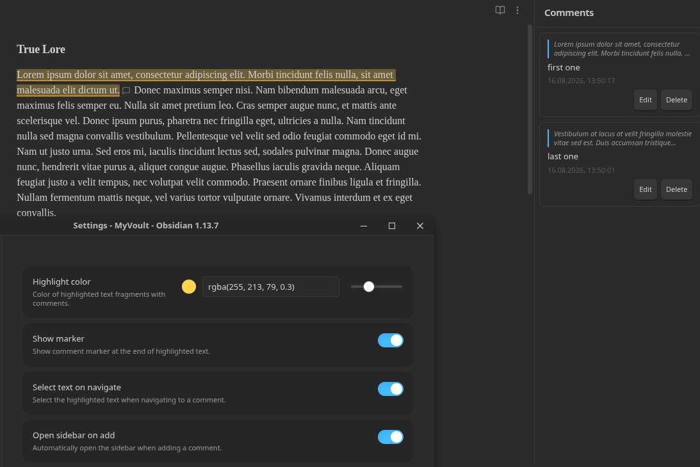

# Side Thing

An Obsidian plugin for adding marginal (sidebar) comments to selected text in your notes (google doc vibe).



## Features

- **Add comments** to any selected text fragment via command palette or right-click context menu
- **Visual highlighting** of commented text directly in the editor (Live Preview mode)
- **Comment markers** — optional SVG icons at the end of each highlighted fragment
- **Sidebar panel** with a list of all comments in the current note
- **Navigation** — click a comment in the sidebar to scroll to its location in the document
- **Edit and delete** comments through a popover or sidebar
- **Overlap prevention** — prevents creating duplicate comments on the same text
- **Localization** — automatically detects Obsidian's interface language (English / Русский)
- **Customizable** — highlight color with color picker and opacity slider, marker visibility, text selection on navigate

## How to use

1. Open a note and select a text fragment
2. Add a comment using one of these methods:
   - **Command palette** (Ctrl/Cmd+P) → "Add side comment"
   - **Right-click** on the selection → "Add side comment"
3. Write your comment in the popover and press **Save** (or Ctrl/Cmd+Enter)
4. The selected text is now highlighted in the editor
5. Open the sidebar via the ribbon icon (💬) or command palette → "Open comments sidebar"
6. Click any comment in the sidebar to navigate to its location
7. Edit or delete comments via the sidebar buttons or by clicking the marker in the editor

## Settings

| Setting | Description | Default |
|---------|-------------|---------|
| Highlight color | Color of highlighted text (with color picker and opacity slider) | `rgba(255, 213, 79, 0.3)` |
| Show marker | Show a comment marker icon at the end of highlighted text | `true` |
| Select text on navigate | Select the highlighted text when navigating to a comment | `true` |
| Open sidebar on add | Automatically open the sidebar when adding a comment | `true` |

## Installation

### Manual installation

1. Download `main.js`, `manifest.json`, and `styles.css` from the latest release
2. Copy them to your vault: `VaultFolder/.obsidian/plugins/side-thing/`
3. Reload Obsidian
4. Enable the plugin in **Settings → Community plugins**

### Development

```bash
# Install dependencies
npm install

# Start development build with watch mode
npm run dev

# Production build
npm run build

# Lint
npm run lint
```

## How it works

- Comments are stored in the plugin's `data.json`, keyed by file path
- Highlighting is implemented via CodeMirror 6 `ViewPlugin` with `DecorationSet`
- The sidebar is an Obsidian `ItemView` registered in the right sidebar
- The comment editor is a `Modal` styled as a floating popover

## File structure

```
src/
  main.ts                 # Plugin lifecycle, command/view registration
  settings.ts             # Settings interface and settings tab UI
  types.ts                # SideComment and CommentsStore interfaces
  store.ts                # Comment storage (loadData/saveData wrapper)
  i18n.ts                 # Localization (English / Russian)
  editor/
    extension.ts          # CodeMirror 6 ViewPlugin for highlighting
  ui/
    comment-popover.ts    # Floating popover for create/edit comment
    sidebar-view.ts       # Sidebar ItemView with comment list
  commands/
    register.ts           # Command and context menu registration
```

## Compatibility

- Requires Obsidian 1.7.2 or later
- Works on desktop and mobile (`isDesktopOnly: false`)
- Highlighting works in Live Preview mode

## API Documentation

See https://docs.obsidian.md

## License

0-BSD
